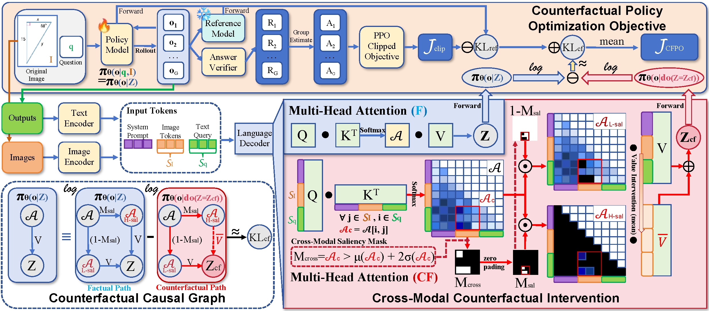

# CFPO: Counterfactual Policy Optimization for Multimodal Reasoning

[](https://github.com/Raven-July/CFPO)
[](https://arxiv.org/abs/2606.23206)
[](https://huggingface.co)
[](LICENSE)

**CFPO** is a counterfactual reinforcement learning framework for multimodal reasoning. It is designed to improve the causal consistency between visual perception and textual reasoning in Large Vision-Language Models (LVLMs), especially when standard outcome-driven RL methods encourage models to obtain correct answers through language priors, shortcut learning, or hallucinated reasoning paths.

Instead of only rewarding final-answer correctness, CFPO explicitly tests whether the model’s prediction is sensitive to the visual evidence it relies on. During policy optimization, CFPO constructs a counterfactual path inside the language decoder by suppressing high-saliency cross-modal visual cues at the representation level. The model is then encouraged to maintain a clear divergence between the factual policy and the counterfactual policy, forcing its reasoning process to depend on valid visual evidence rather than blind linguistic priors.

<p align="center">
  
</p>

## Highlights

* **Counterfactual policy optimization for LVLMs.** CFPO introduces cross-modal counterfactual intervention into RL-style multimodal reasoning training.
* **Representation-level visual evidence test.** CFPO intervenes on attention outputs rather than applying coarse input-level random masking.
* **Improved causal grounding.** The method targets common multimodal reasoning failures, including visual saliency deficiency, saliency misalignment, and saliency inertia.
* **Compatible with existing RL pipelines.** CFPO is implemented on top of GRPO and DAPO-style policy optimization and does not require external reward models or additional supervised fine-tuning.
* **Stronger multimodal reasoning performance.** In the paper, CFPO consistently improves over standard RL baselines and perception-aware RL baselines on both real-world-centric and mathematic-centric multimodal reasoning benchmarks.

## Method Overview

CFPO introduces a **Cross-Modal Counterfactual Intervention** mechanism into the policy optimization loop.

Given an image-question pair, the standard factual path produces the original attention output `Z` and policy distribution `πθ(o | Z)`. CFPO then constructs a counterfactual representation `Zcf` by identifying high-saliency cross-modal regions in the attention matrix and suppressing their effective visual contribution. This produces a counterfactual policy distribution `πθ(o | do(Z = Zcf))`.

The key idea is simple: if removing critical visual cues does not change the model’s prediction, the response is likely driven by language priors rather than genuine visual reasoning. CFPO therefore maximizes the discrepancy between the factual and counterfactual distributions through a counterfactual regularization term.

Concretely, CFPO:

1. Extracts the cross-modal attention matrix between text query tokens and image tokens.
2. Builds a high-saliency mask using a statistical threshold over cross-modal attention scores.
3. Replaces high-saliency visual value representations with an image-token mean prior to construct the counterfactual path.
4. Computes the divergence between factual and counterfactual policy distributions.
5. Integrates the counterfactual regularization term into GRPO or DAPO training objectives.

The resulting variants are denoted as:

* **CFPO-G**: CFPO integrated with GRPO.
* **CFPO-D**: CFPO integrated with DAPO.

## Data
Datasets WIP.

The paper uses **ViRL39K** as the training set, which contains verifiable multimodal reasoning QA pairs for vision-language reinforcement learning.

Please check the dataset licenses and original sources before redistribution. Some benchmark datasets may need to be downloaded separately from their official repositories.

## Installation

A Conda environment is recommended.

### 1. Create and activate environment

```bash
conda create -n cfpo python=3.10
conda activate cfpo
```

### 2. Install core PyTorch packages

Please make sure that the CUDA version is compatible with your local system.

```bash
pip install \
  torch==2.5.1 \
  torchvision==0.20.1 \
  torchaudio==2.5.1 \
  torchdata==0.11.0
```

### 3. Install acceleration and language-model dependencies

```bash
pip install https://github.com/Dao-AILab/flash-attention/releases/download/v2.7.4.post1/flash_attn-2.7.4.post1+cu12torch2.5cxx11abiFALSE-cp310-cp310-linux_x86_64.whl
pip install vllm==0.9.1
pip install transformers==4.52.4
pip install -e .
```

Notes:

* The flash-attention wheel above is tied to specific CUDA, PyTorch, Python, and ABI versions. Please replace it with the correct wheel for your environment if necessary.
* If binary installation fails, check your CUDA toolkit, compiler version, and PyTorch build.
* This repository is developed on Linux GPU servers. Windows is not officially supported for training.

## Quick Start
 
**Training**
 
```bash
# CFPO with GRPO backbone (Qwen2.5-VL-3B)
sh ./examples/qwen2_5_vl_3b_CFPO-G-math.sh
 
# Standard GRPO baseline (Qwen2.5-VL-3B)
sh ./examples/qwen2_5_vl_3b_GRPO-math.sh

# CFPO with DAPO backbone (Qwen2.5-VL-3B)
sh ./examples/qwen2_5_vl_3b_CFPO-D-math.sh
 
# Standard DAPO baseline (Qwen2.5-VL-3B)
sh ./examples/qwen2_5_vl_3b_DAPO-math.sh
```
 
Evaluation and inference scripts will be added upon rearrangement of the evaluation pipeline.
 
## Training Details
 
The 3B model variants (CFPO_G / CFPO_D) are trained on **2× NVIDIA A800 80G GPUs** using the PyTorch 2.6.0 framework. The table below summarizes the key hyperparameters reported in the paper:
 
| Parameter | Value |
|---|---|
| Base model | Qwen2.5-VL-3B (direct RL, no SFT warm-up) |
| Training dataset | ViRL39K (38,870 QA pairs) |
| Training epochs | 2 |
| Learning rate | 1e-6 |
| Weight decay | 1e-2 |
| Rollout batch size | 384 |
| Responses per prompt (G) | 5 |
| Response format | `<think>...</think>` + `\boxed{}` |
| Counterfactual coefficient γ (CFPO_G) | 0.02 (no entropy loss) |
| Counterfactual coefficient γ (CFPO_D) | 0.01 (+ entropy loss η=0.03) |
| Saliency threshold λ | 2 (outlier criterion: μ + 2σ) |
 
All hyperparameters are also specified directly in the shell scripts listed under [Quick Start](#quick-start).
 
> **Why 2× A800?** The CFPO counterfactual forward pass adds approximately 9.6 GB of peak VRAM overhead and roughly 350 s/step additional training time versus the GRPO baseline (see Appendix B of the paper). This overhead is attributable to an engineering bottleneck—fine-grained latent-level interventions currently interrupt fused kernel execution (e.g., FlashAttention), triggering an operator fallback. Custom CUDA kernel implementations are planned for future releases to substantially reduce this cost.
 
## Implementation Status
 
| Component | Status |
|---|---|
| Training algorithm — CFPO_G / CFPO_D on Qwen2.5-VL-3B | ✅ Released (validation ongoing) |
| Datasets | 🔄 In progress |
| Training algorithm — CFPO_G on Qwen3-VL-2B-Thinking | 🔄 In progress |
| Qwen2.5-VL-3B fine-tuned checkpoints | 🔄 In progress |
| Qwen3-VL-2B-Thinking fine-tuned checkpoints | 🔄 In progress |
| Evaluation pipeline & inference scripts | 🔄 In progress |
| Qwen2.5-VL-7B fine-tuned checkpoints | 🔜 Coming soon |
| Reduced training overhead | 📋 Planned |
 
**Release notes:**
 
- The core CFPO training algorithm has been released. Ongoing validation is in progress; follow-up patches will be published to resolve any remaining issues. Some module paths may require minor adjustments across different CUDA or PyTorch environments.
- The **Qwen2.5-VL-7B** checkpoint is currently being fine-tuned. Preliminary paper results (Table 6) show CFPO_G improving average accuracy from 62.30% to 63.43% over the GRPO baseline, outperforming PAPO_G on 7 out of 10 benchmarks without any additional hyperparameter tuning.
- A checkpoint based on **Qwen3-VL-2B-Thinking** is forthcoming. Early results (Table 5 in the paper) demonstrate particularly strong gains on this architecture (55.92% vs. 46.84% for GRPO and 49.30% for PAPO_G), reflecting CFPO's effectiveness on models with architectural advances such as DeepStack and Interleaved-MRoPE.
Please open an issue if you encounter compatibility problems or unexpected behavior. PRs for bug fixes are always welcome.
 
## Evaluation & Reproduction
 
Evaluation commands and dataset preparation scripts will be added once the evaluation pipeline is finalized. When reproducing results, please use the exact evaluation settings described in the paper (8 rollouts per sample, specified benchmark subsets) to ensure comparability with reported numbers.
 
## Acknowledgements
 
We thank the [EasyR1](https://github.com/hiyouga/EasyR1) team for providing the foundational RL training framework that this project builds upon.
 
## Citation
 
If you use CFPO in your work, please cite:
 
```bibtex
@misc{yu2026cfpocounterfactualpolicyoptimization,
      title={CFPO: Counterfactual Policy Optimization for Multimodal Reasoning}, 
      author={Zhangyuan Yu and Wanran Sun and Guangjing Yang and Xiaohu Wu and Qicheng Lao},
      year={2026},
      eprint={2606.23206},
      archivePrefix={arXiv},
      primaryClass={cs.CV},
      url={https://arxiv.org/abs/2606.23206}, 
}
```
 
## Contributing
 
Issues and pull requests are welcome. For significant changes or new features, please open an issue first to discuss the proposed design before submitting a PR. When reporting bugs, please include your environment details (OS, CUDA version, PyTorch version) and a minimal reproducible example where possible.
 
## License
 
This project is released under the [Apache-2.0 License](LICENSE).